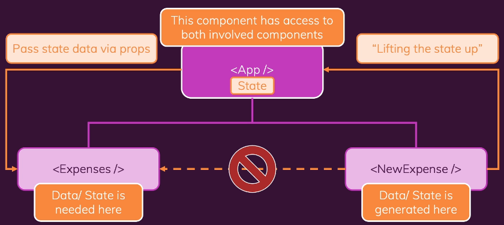

# User interaction & State
- Making apps interactive & reactive

### Module Content
1. Handling Events
2. Updating the UI & Working with "State"
3. A closer Look at components & state
---------------------------------------------
기존>   
내장된 html 요소에 추가해서 이벤트들을 수신할 수 있다. 
리스너를 추가하는 대신에 ID로 요소를 선택하고 이벤트 리스너를 추가하는 명령형방식이었다면 
리액트>  
**리액트**는 버튼을 JSX요소로 이동해서 리스너를 추가한다. 그리고 props를 추가해준다.  
***리액트는 모든 기본 이벤트를 on으로 시작하는 props로 노출한다.***
모든 이벤트 핸들러 props는 값으로 함수가 필요하다.  
onClick과 같이 on props에 대한 값으로 전달되는 함수는 이벤트가 발생했을때 실행되어야 한다.  
내장된 HTML 요소에 지원되는 이벤트 리스너를 추가할 수 있고, 기본적으로 DOM의 동작에 기반한다. 
 
**리액트 작동방식!**  
컴포넌트 = 함수형이고, JSX를 반환 
함수이기 때문에 호출 필요, 하지만 react에서 따로 호출한적 없다.  
대신 JSX코드 안에 있는 HTML처럼 생긴 컴포넌트를 이용해서 리액트가 우리의 컴포넌트 함수로 인식하도록 만든다.  
_리액트는 JSX코드를 평가할때마다 컴포넌트 함수들을 호출할것이며, 이 컴포넌트 함수들은 평가할 JSX코드가 없을때까지 JSX코드로 반환하려고 한다_ 
전반적인 함수 컴포넌트를 평가하고 DOM 명령어로 번역해서 화면에 렌더링하는것이 리액트 작동방식이다. 

**문제점** 
리액트는 절대 반복하지 않는다. 처음 렌더링되었을때 모든 과정을 실행하고 그후에 끝이다. 
화면에 업데이트를 하기위해 도입된 state 

### State 
양반형바인딩 구현 가능. 
**state 변수** 
변수에 새로운 값을 할당하기 위해 우리가 호출 할 수 있는 함수도 반환한다. 
등호를 사용해서 값을 할당하지 않고, 함수를 호출해서 새로운값을 할당하는 방식이다. 
만약 변화하는 데이터를 갖고있는데 그 변화하는 데이터가 사용자 인터페이스에 반영되어야 한다면 state가 필요하다 
**일반적인 변수는 수행하지 않지만 state를 사용하면 값을 설정하고 변경할 수 있다.  
state가 바뀌면 리액트는 그 state가 등록된 컴포넌트만 재평가할 것이다.** 
state는 컴포넌트의 인스턴스별로 나뉘어있다. 

#### useState
_useState를 사용해서 상태를 등록하면 항상 두개의 값을 얻는데 현재 상태값과 업데이트하는 함수이며, useState를 다시 호출하면 새로운 상태가 생성된다._ 
그리고 state가 변할때마다 업데이트 함수를 호출하고, JSX코드에서 그것을 출력하기 위해 상태값을 사용하고 싶을떄마다 첫번째요소를 사용한다. 
상태가 변할때마다 컴포넌트형 함수를 다시 실행하고 JSX 코드를 다시 평가한다. 반응성을 추가하는 것이다. 
useState를 통해 "상태"값을 생성해 JSX에서 변경 및 출력을 한다. 
React는 일부 변숫값의 변경 여부에 관심없음 
컴포넌트 함수를 재평가하지도 않는다. 등록된 상태 값(useState를 통해 생성)이 변경되었을 때만 재평가가 이루어진다. 

**useState로 생성된 컴포넌트 상태는 어떻게 업데이트 가능한가?** 
useState는 정확히 두 요소로 이루어진 배열을 반환한다.  
두 번째 요소는 언제나 상태에 새 값을 설정하기 위해 호출하는 함수다. 해당 함수를 호출하면 React가 컴포넌트를 재평가하도록 트리거한다.

## Lifting State up
데이터를 자식컴포넌트에서 부모 컴포넌트로 이동하는 방법 
props를 사용해서 부모 컴포넌트로부터 함수를 받고 자식 컴포넌트에서 그 함수를 불러온다. 
컴포넌트 트리에서 필요한 만큼 끌어올리는데 데이터를 생성하는 컴포넌트와 데이터가 필요한 컴포넌트에 접근할 수 있으면된다. 
프로퍼티를 통해 함수를 받아들이고 하위 자식 컴포넌트 내부로부터 호출하고 해당함수를 부모 컴포넌트에 전달하는 방식으로 일부작업을 트리거 할 수 있다. 
JavaScript에서 함수는 단순한 객체(일반 값)이므로 프로퍼티를 통해 값을 컴포넌트에 전달할 수 있다. 
그리고 컴포넌트가 해당 함수를 호출하면 함수가 실행된다. 
이런 식으로 부모 컴포넌트에 정의된 함수를 자식 컴포넌트 내부에서 트리거할 수 있다.

onClick과 같은 이벤트 리스너 프로퍼티에는 실행될 함수의 “포인터”를 onClick 등의 값으로 전달해야 한다. 
그러면 이벤트가 발생했을 때 “사용자를 대신하여” React가 함수를 실행한다.

